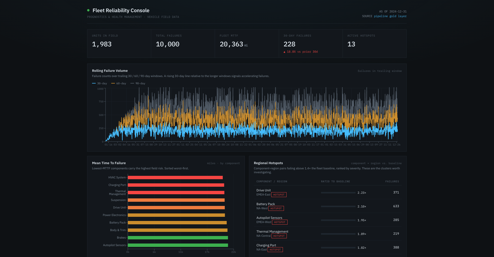
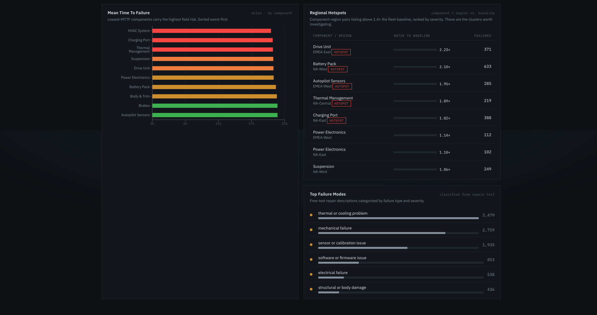

# Fleet Reliability Console

A React + Node/Express console over the **Vehicle Field Reliability Intelligence System** pipeline. It reads the pipeline's gold-layer output and surfaces the signals a reliability team acts on: mean time to failure by component, rolling 30/60/90-day failure-volume trends, regional failure clustering (hotspot detection), and top failure modes classified from free-text repair records.

## Stack

- **Front end:** React 18 + Vite + Recharts
- **API:** Node.js + Express
- **Data source:** the reliability pipeline's Postgres gold tables (with a zero-config seed mode for local demo)

## Architecture

\`\`\`
  React (Vite :5173)  --/api-->  Express (:4000)  -->  data layer
                                                        |- seed  (data.json)
                                                        \`- postgres (gold tables)
\`\`\`

The data layer (\`server/db.js\`) returns identical shapes in both modes, so the API and UI are agnostic to where the numbers come from.

## Run it

\`\`\`bash
npm run install:all     # installs root, server, and client deps
npm run seed            # generates placeholder data so it runs immediately
npm run dev             # starts API (:4000) and client (:5173) together
\`\`\`

Open http://localhost:5173.

## Connecting to the real pipeline output

The dashboard ships in \`seed\` mode so it runs before it's connected. To serve the live pipeline output:

1. \`cp server/.env.example server/.env\`
2. Set \`DATA_MODE=postgres\` and \`DATABASE_URL\` to your reliability database.
3. \`server/queries.js\` is already mapped to the pipeline's gold/silver schema:

   | Panel                | Source table                        |
   | -------------------- | ----------------------------------- |
   | MTTF by component    | \`gold.fct_component_mttf\`           |
   | Rolling failure vol. | \`gold.fct_failure_rate_rolling\`     |
   | Regional hotspots    | \`gold.fct_failure_clusters\`         |
   | Failure modes        | \`gold.fct_repair_nlp_enriched\`      |
   | Fleet KPIs           | \`silver.stg_repair_records\` + above |

Restart the server and the dashboard serves live data. No UI edits required.

## A note on the data

The underlying data is **synthetic**, generated by the pipeline's own record generator with **injected component-region skew** (e.g. Drive Unit failures concentrated in EMEA-East) so the clustering logic has real signal to detect. The dashboard, API, pipeline, and analytics are production-shaped; the data is simulated. Regional hotspots shown (2.0-2.9x baseline) are the injected clusters being correctly surfaced end-to-end.

## Endpoints

| Endpoint                        | Returns                                          |
| ------------------------------- | ------------------------------------------------ |
| \`GET /api/summary\`              | fleet KPIs (units, failures, MTTF, hotspots)     |
| \`GET /api/mttf-by-component\`    | MTTF (miles) per component, worst-first          |
| \`GET /api/rolling-failure-rate\` | 30/60/90-day rolling failure volume time series  |
| \`GET /api/regional\`             | top component-region hotspot pairs by ratio      |
| \`GET /api/failure-modes\`        | NLP-classified failure modes by count + severity |
